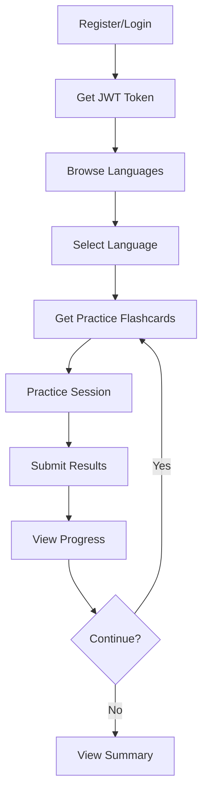

# API Documentation

Complete API documentation for the Flashcards Learning Platform - Learn programming language keywords through AI-generated flashcards with progress tracking.

---

## Documentation Files

### 📘 [Complete API Documentation](./API_DOCUMENTATION.md)
**Start here** for an overview of the entire API, quick start guide, and common use cases.

**Contents:**
- Quick start guide
- Authentication overview
- Response formats
- Error handling
- Database schema
- Environment setup
- Common use cases

---

### 🔐 [Authentication API](./AUTH_API.md)
User registration and login with JWT token authentication.

**Endpoints:**
- `POST /api/auth/register` - Register new user
- `POST /api/auth/login` - Login and get JWT token

**Features:**
- Email/password authentication
- Bcrypt password hashing
- JWT tokens (7-day expiration)
- Secure token-based access

---

### 🗣️ [Language API](./LANGUAGE_API.md)
Programming language information and supported languages.

**Endpoints:**
- `GET /api/languages/supported` - Get all supported languages with keywords
- `GET /api/languages` - Get languages with generation status
- `GET /api/languages/:slug` - Get specific language details

**Supported Languages:**
- Python (35 keywords)
- JavaScript (52 keywords)
- Java (50 keywords)
- TypeScript (72 keywords)
- C++ (92 keywords)
- Go (25 keywords)
- Rust (54 keywords)
- C (57 keywords)
- Kotlin (75 keywords)

---

### 🎴 [Flashcard API](./FLASHCARD_API.md)
AI-powered flashcard generation and retrieval.

**Endpoints:**
- `POST /api/flashcards/generate/:slug` (Public) - Generate flashcards using AI
- `GET /api/flashcards/:slug` (Protected) - Get all flashcards for a language

**Features:**
- AI-generated questions and answers
- Working code examples for each keyword
- OpenRouter KAT-Coder-Pro model
- One-time generation per language
- 517 total flashcards across all languages

**Each flashcard includes:**
- Programming keyword
- Question about the keyword
- Detailed answer/explanation
- Working code example

---

### 📊 [Progress & Practice API](./PROGRESS_API.md)
Learning progress tracking with intelligent practice sessions.

**Endpoints:**
- `GET /api/progress/practice/:slug?limit=10` - Get flashcards for practice
- `POST /api/progress/practice/:slug` - Submit practice results
- `GET /api/progress/language/:slug` - Get progress for specific language
- `GET /api/progress/summary` - Get overall progress summary

**Features:**
- Per-flashcard progress tracking
- Mastery level system (Beginner → Intermediate → Advanced → Mastered)
- Smart practice prioritization
- Accuracy percentage calculation
- Practice session management
- Historical performance tracking

**Mastery Levels:**
- **Beginner:** Just started (< 3 attempts)
- **Intermediate:** Getting familiar (≥50% accuracy, ≥3 attempts)
- **Advanced:** Strong understanding (≥75% accuracy, ≥5 attempts)
- **Mastered:** Complete mastery (≥90% accuracy, ≥10 attempts)

---

## Quick Reference

### Base URL
```
http://localhost:5000
```

### Authentication Header
```
Authorization: Bearer <your-jwt-token>
```

### Content Type
```
Content-Type: application/json
```

---

## Typical User Flow



### Step-by-Step
1. **Register** → `POST /api/auth/register`
2. **Login** → `POST /api/auth/login` (receive JWT token)
3. **Browse Languages** → `GET /api/languages`
4. **Get Practice Flashcards** → `GET /api/progress/practice/python?limit=10`
5. **User Practices** (frontend shows questions, user types answers)
6. **Submit Results** → `POST /api/progress/practice/python`
7. **View Progress** → `GET /api/progress/language/python`
8. **Overall Summary** → `GET /api/progress/summary`

---

## Module Overview

| Module   | Public Endpoints | Protected Endpoints | Description                          |
|----------|------------------|---------------------|--------------------------------------|
| Auth     | 2                | 0                   | User registration and login          |
| Language | 0                | 3                   | Programming language information     |
| Flashcard| 1                | 1                   | AI flashcard generation and retrieval|
| Progress | 0                | 4                   | Practice sessions and progress tracking|

**Total Endpoints:** 11 (3 public, 8 protected)

---

## Response Status Codes

| Code | Meaning           | When It Occurs                           |
|------|-------------------|------------------------------------------|
| 200  | OK                | Successful request                       |
| 201  | Created           | Resource successfully created            |
| 400  | Bad Request       | Invalid request data                     |
| 401  | Unauthorized      | Missing or invalid authentication        |
| 404  | Not Found         | Resource doesn't exist                   |
| 500  | Server Error      | Internal server error                    |

---

## API Statistics

- **Total Languages:** 9
- **Total Keywords:** 517
- **Total Flashcards:** 517
- **Total Endpoints:** 11
- **Auth Required:** 8 endpoints
- **Public Access:** 3 endpoints

---

## Testing Tools

### Recommended Tools
- **cURL** - Command line testing (examples in each doc)
- **Postman** - GUI API testing
- **Thunder Client** - VS Code extension
- **Insomnia** - Desktop API client

### Example Collections
Each module documentation includes complete cURL examples for all endpoints.

---

## Integration Examples

### JavaScript/Node.js
```javascript
const axios = require('axios');

// Login
const { data } = await axios.post('http://localhost:5000/api/auth/login', {
  email: 'user@example.com',
  password: 'password123'
});

const token = data.data.token;

// Get flashcards
const flashcards = await axios.get(
  'http://localhost:5000/api/flashcards/python',
  { headers: { Authorization: `Bearer ${token}` } }
);
```

### Python
```python
import requests

# Login
response = requests.post('http://localhost:5000/api/auth/login', json={
    'email': 'user@example.com',
    'password': 'password123'
})

token = response.json()['data']['token']

# Get flashcards
headers = {'Authorization': f'Bearer {token}'}
flashcards = requests.get(
    'http://localhost:5000/api/flashcards/python',
    headers=headers
)
```

### React/Frontend
```javascript
// Login
const login = async (email, password) => {
  const response = await fetch('http://localhost:5000/api/auth/login', {
    method: 'POST',
    headers: { 'Content-Type': 'application/json' },
    body: JSON.stringify({ email, password })
  });
  const data = await response.json();
  localStorage.setItem('token', data.data.token);
};

// Get flashcards with token
const getFlashcards = async (language) => {
  const token = localStorage.getItem('token');
  const response = await fetch(
    `http://localhost:5000/api/flashcards/${language}`,
    { headers: { Authorization: `Bearer ${token}` } }
  );
  return response.json();
};
```

---

## Common Errors & Solutions

### Error: "No token provided"
**Solution:** Include Authorization header with Bearer token

### Error: "Invalid token"
**Solution:** Check token format, ensure it's not expired, login again

### Error: "Language not found"
**Solution:** Use correct language slug (lowercase): python, javascript, java, etc.

### Error: "Flashcards already generated"
**Solution:** Flashcards can only be generated once per language

### Error: "User already exists"
**Solution:** Email is already registered, use login instead

---

## Additional Resources

- **Environment Variables:** See `API_DOCUMENTATION.md` for required env vars
- **Database Schema:** Full schema details in `API_DOCUMENTATION.md`
- **Error Codes:** Complete list in `API_DOCUMENTATION.md`

---

## Support

For detailed information on each module:
1. Check the specific module documentation
2. Review the complete API documentation
3. Examine the cURL examples provided
4. Test endpoints using the provided examples

---

## Version

**Current Version:** 1.0.0

**Last Updated:** November 2025
